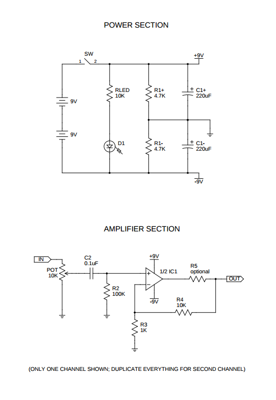

# cmoy-amplifier-build

After being a musician the majority of my life, I felt it was time to attempt my first audio electronics projects (I've made a lot of general electronics projects).

I needed to build a headphone amplifier, and thus I found the CMoy amplifier. (aka OPA2132/OPA2134 IC)

After a very brief google search, I found the brilliant [Tangentsoft's 'How to Build the CMoy Pocket Amplifier'](https://tangentsoft.net/audio/cmoy/), a brilliant wiki, packed with information.

They neatly state:

> Chu Moy designed a very popular headphone amplifier that’s easy to build, and it can be built small enough to fit in a pocket, power supply and all. It’s powerful enough to drive very inefficient headphones to thunderous volumes from even weak sources, and it sounds excellent considering that you can build a bare-bones CMoy amp for just US$20, and a pretty nice amp for under $50. Considering that the cheapest of the worthy commercial amps is $100 and most of them are in the $200+ range, this is a very worthwhile cost difference.

## Schematic

## Parts
